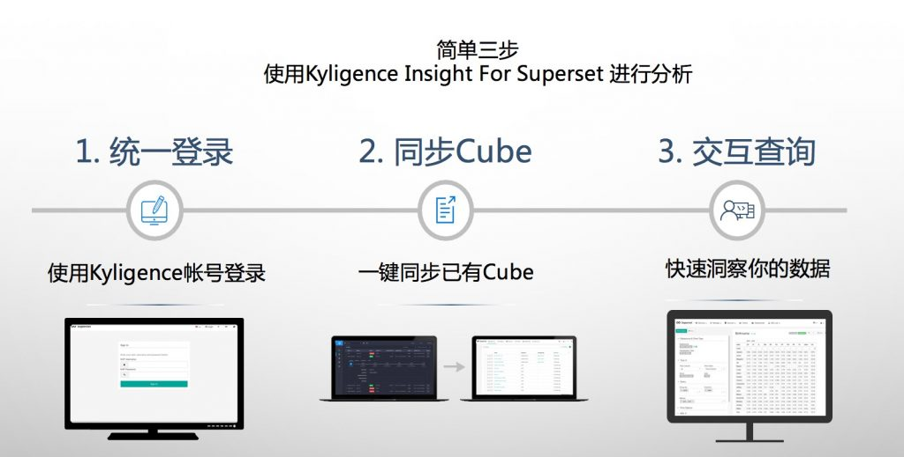

Kyligence Insight for Superset 简介
==============================

随着业务数据的数据量及数据复杂性的不断增长，传统的数据处理及数据分析方式已经无法满足需要，如何从海量数据中分析、挖掘出具有业务意义的信息？如何灵活、快速、高效地借力大数据发展BI应用？如何简化企业已有的数据仓库和BI产品对接的繁琐流程？由此越来越多的企业用户开始寻找新的解决方案。

Kyligence Insight For Superset——以全球最受欢迎的开源BI 应用 Apache Superset (incubating)
为基础，由Kyligence工程师深度定制，无缝集成Kylin大数据处理能力，赋能企业大数据分析，丰富Kylin生态圈，提供大数据分析的一站式解决方案。

Kyligence / Apache Kylin 
^^^^^^^

Apache Kylin
是领先的大数据分析技术（OLAP-on-Hadoop），提供超大数据集上的亚秒级查询能力，拥有超过1000家生产用户。Kyligence是基于Kylin的企业级大数据分析平台，提供企业级的安全管理及自动建模能力。

Superset 
^^^^^^^

Superset 是一个用于数据探索和可视化功能的，开源的商务智能（BI）应用。其轻量的语义层定义，炫目的可视化效果,
成熟的数据抽象层可以用来提供敏捷、美观、稳定的交互式分析体验。

| |image0| 

Superset 具有如下特点：

| 1. 学习成本低，易于上手
| 2. 丰富美观，可拓展的可视化图表及仪表板
| 3. 完善的分析功能：筛选／排序／Top N 等
| 4. 支持分享／导出数据文件／平台集成／报表权限 等企业级需求
| 5. 支持自定义维度 / 度量（CRUD）
| 6. Web端应用，相比传统的C/S模式，客户端零安装，零维护，系统的扩展非常容易

|image1|

|image2|

Kyligence Insight for Superset
^^^^^^^

| 为了服务Kyligence /Kylin
  的用户，Kyligence开发了定制版的Superset：Kyligence Insight for
  Superset （以下简称
  Superset），它的出现丰富了Kylin生态圈，使得Kyligence/
  Kylin的用户多了一种选择。

|image3|

"Superset" 与Kyligence /Kylin实现无缝对接，直接通过Kyligence
/Kylin账号登录，一键同步cube并在
"Superset"上进行数据探索及可视化，省去反复建模的重复工作，尽享极速，高效的大数据分析体验。

相比原生Superset, Kyligence的"Superset" 提供了如下增强功能：

| 1.
  统一用户管理，用户无需在“Superset”上额外创建用户和赋予权限，统一在Kyligence/Kylin后端管理用户访问权限，直接使用Kyligence/Kylin
  账户登录Superset
| 2. 一键同步Kyligence/Kylin
  Cube，无需在Superset端重新定义数据模型，直接查询Cube
| 3. 支持多表连接模型，支持inner join和outer join。
| 4. Docker容器化部署Superset，一键启动，降低部署和升级门槛。
| 5. 自动适配Kyligence/Kylin 查询语法

.. |image1| image:: ./images/Introduction_cn/02.png
   
.. |image2| image:: ./images/Introduction_cn/03.png

   
