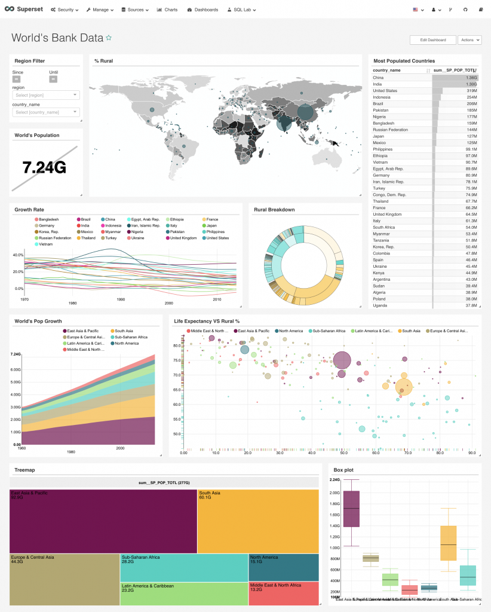
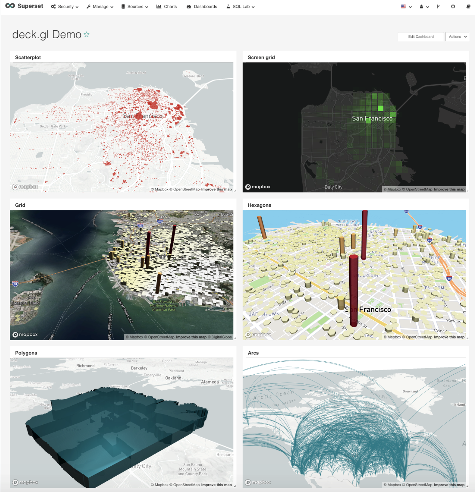
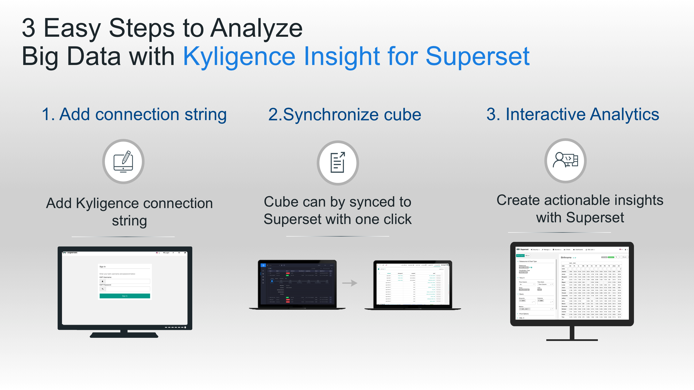

Kyligence Insight for Superset Introduction
==============================

With the ever-growing data volume and complexity, the legacy method of
data processing and analytics can longer satisfy the demand of
uncovering actionable insight from big data. To build an infrastructure
that supports swift and effective big data analytics, enterprises turn
to Kyligence technology as their de facto big data analytics solution.
For those companies, they are facing the challenge of adopting a
Business Intelligence (BI) solution that is lightweight and
easy-to-integrate with Kylin.

Kyligence Insight for Superset, a business intelligence web application
that customized based on Apache Superset (incubating), the most popular
open source business intelligence web application, is a perfect solution
designed for Kyligence customers who are looking for BI that can deeply
integrate with Kyligence technology. In addition, Kyligence Insight for
Superset adds no extra cost for Kyligence customer, which helps
customers to build a cost-effective big data solution with Kyligence
technology as a core.

About Kyligence/ Apache Kylin 
^^^^^^^
Kyligence Inc. is a leading data intelligence company which focuses on
big data analytic technology innovation. It is founded by the team who
created Apache Kylin, a leading open source OLAP for Big Data project.
Kyligence is offering on-premises big data analytic platform- Kyligence
Enterprise and its cloud product - Kyligence Cloud.

About Superset 
^^^^^^^

|image0|

Apache Superset is a data exploration and visualization platform
designed to be visual, intuitive, and interactive. As the most popular
open source BI in the industry, Superset provides below advantages to
its users:

| 1. Intuitive and interactive, easy to learn and easy to deploy.

| 2. Eye-catching dashboards and D3-based extendable visualizations.

| 3. Fully-fledged reporting features: filtering, sorting, page-by and
etc.

| 4. Enterprise-ready features: sharing, exporting, portal integration and
reports permission.

| 5. Customizable reporting dimension and measures.

| 6. Easy-to-deploy and easy-to-maintain web-based application.

|image1| |image2|

About Kyligence Insight for Superset
^^^^^^^

To better serve Kyligence or Kylin users, Kyligence Insight for Superset
is the customized Superset that enriches Kylin ecosystem, providing
alternative analytics option for end-users.

Kyligence Insight for Superset is tailored to be seamlessly integrated
with Kyligence or Kylin, that provides smooth analytical experience from
Kyligence or Kylin to Superset, reduces duplicated manual efforts, and
speed up time-to-insight.\ |image3|\ Beyond Superset, Kyligence Insight
for Superset provides following features that differentiate between
itself and Superset.

| Sync Kyligence or Kylin Cube with one click. With one click in
Kyligence Insight for Superset, users can sync Kyligence or Kylin Cube
immediately and start analyzing Cube instantly.

| Support querying on multiple table data model on Kyligence or Kylin
Cube. The User can analyze Cube with either star schema data model or
snowflake schema data model.

| Deploy Superset with Docker. Users may easily deploy, maintain and
upgrade Kyligence Insight for Superset with Docker.

| Fine-tuned query syntax for Kyligence or Kylin query engine. Query
pattern is fine-tuned to work best on Kyligence or Kylin data engine.

